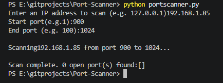

# Basic Port Scanner

A simple Python command-line tool that scans a target IP address across a 
range of ports to check which ones are open, using raw TCP socket 
connections.

## Ethical use notice
This tool is for educational use on systems I own or have explicit 
permission to test (e.g. localhost / my own home network). Unauthorized 
port scanning of third-party systems may violate computer misuse laws.

## Why I built this
Continuing my networking + Python self-study, I wanted to understand how 
port scanning actually works under the hood rather than just running a 
tool like Nmap without knowing what it's doing. This project uses Python's 
built-in `socket` library to manually attempt a connection to each port 
in a given range and report which ones respond.

## What it does
Takes a target IP address and a port range, then reports which ports in 
that range are open (accepting connections) versus closed.

## How to run it
```bash
python port_scanner.py
```
You'll be prompted for:
- Target IP address (e.g. `127.0.0.1` for your own machine)
- Start port (e.g. `1`)
- End port (e.g. `100`)

## Example



## How it works
- `scan_port()` opens a socket connection attempt to a single port and 
  returns whether it succeeded (open), failed (closed), or the target 
  address itself was invalid
- `scan_range()` loops through every port from start to end, calling 
  `scan_port()` on each, and collects the results
- `settimeout(1)` prevents the scanner from hanging indefinitely on 
  unresponsive hosts
- `try/except` catches invalid IP addresses so the program fails 
  gracefully instead of crashing

## What I learned
- How TCP port scanning works at a basic level — attempting a connection 
  and checking the result, rather than anything more advanced
- How to use Python's `socket` module for real network programming
- Why timeouts matter when scanning unresponsive or non-existent hosts
- That "0 open ports" is a valid, expected result — not a bug — since 
  most consumer machines have no active listening services by default
- Scan range size directly affects scan time: testing a small range vs. 
  a large one made the real-world performance trade-off concrete, not 
  just theoretical

## Possible improvements
- Add multithreading to scan multiple ports simultaneously (much faster 
  for large ranges)
- Add banner grabbing to identify what service is running on open ports
- Export results to a file instead of just printing them